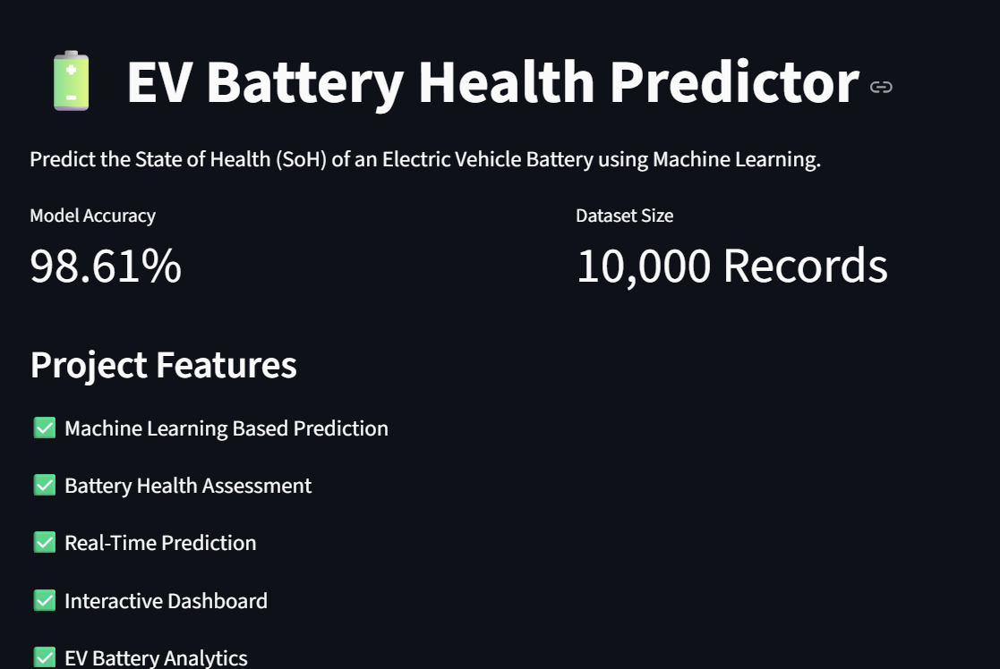
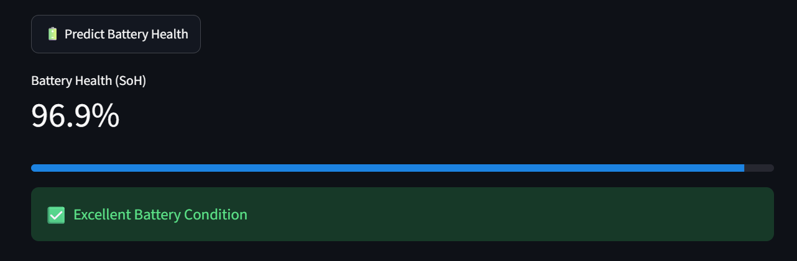
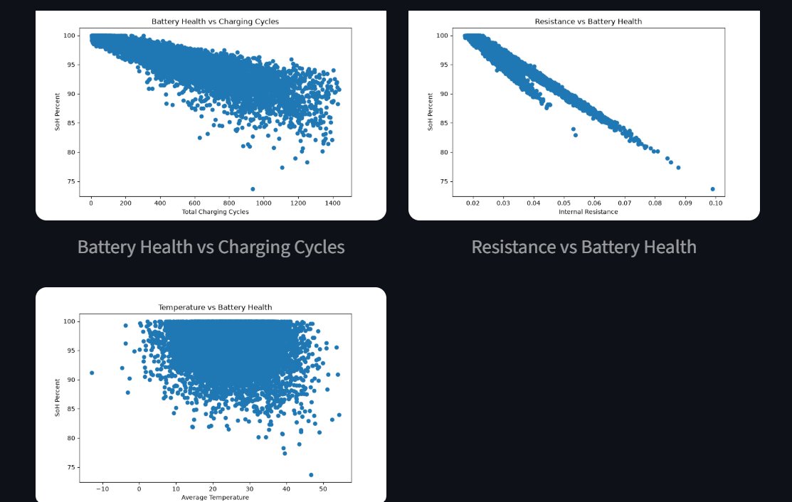

# 🔋 EV Battery Health Predictor

## Overview

EV Battery Health Predictor is a Machine Learning project that predicts the State of Health (SoH) of an Electric Vehicle Battery using battery operating parameters.

The application provides real-time battery health prediction through an interactive Streamlit dashboard.

---

## Features

* Battery Health Prediction
* Interactive Streamlit Dashboard
* Real-Time Analysis
* Data Visualization
* Machine Learning Based Prediction
* User-Friendly Interface

---

## Dataset

Dataset Size: 10,000 Records

### Input Features

* Charge Cycles
* Voltage
* Temperature
* Capacity

### Target

* Battery State of Health (SoH)

---

## Machine Learning Model

Models Evaluated:

* Linear Regression
* Random Forest Regressor

Selected Model:

* Random Forest Regressor

Accuracy Achieved:

**98.61%**

---

## Technologies Used

* Python
* Pandas
* Scikit-Learn
* Streamlit
* Matplotlib
* Pickle

---

## Dashboard



---

## Prediction Example



---

## Graph Analysis



---

## Installation

Clone the repository:

```bash
git clone YOUR_REPOSITORY_LINK
```

Install dependencies:

```bash
pip install -r requirements.txt
```

Run the application:

```bash
streamlit run app.py
```

---

## Future Improvements

* Deep Learning Models
* Battery Life Forecasting
* Cloud Database Integration
* Mobile Application
* Real-Time Sensor Data Support

---

## Author

Rohan

Machine Learning Project – EV Battery Health Prediction
